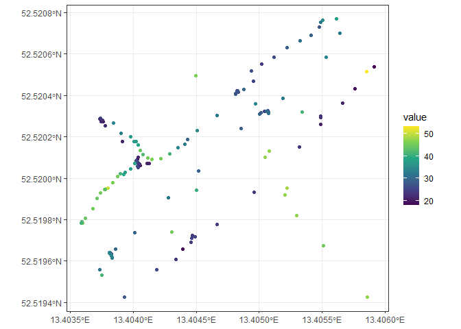

[](https://www.buymeacoffee.com/javierelio)


# safecastR

## Overview

*safecastR* package provides functions for interacting with the
[Safecast API](https://api.safecast.org/).

## Installation

``` r
if (!require("remotes")) install.packages("remotes")
remotes::install_github("javiereliomedina/safecastR")
```

## Usage

``` r
library(safecastR) 
dat <- get_measurements(dist = 100,
                        lat  = 52.520, 
                        long = 13.405)
dat
#> Simple feature collection with 180 features and 14 fields
#> Geometry type: POINT
#> Dimension:     XY
#> Bounding box:  xmin: 13.40359 ymin: 52.51942 xmax: 13.40591 ymax: 52.52077
#> Geodetic CRS:  WGS 84
#> First 10 features:
#>           id user_id value unit location_name device_id original_id
#> 1  147193708     671    21  cpm            NA        NA          NA
#> 2  147193709     671    21  cpm            NA        NA          NA
#> 3  147193715     671    21  cpm            NA        NA          NA
#> 4  147193717     671    24  cpm            NA        NA          NA
#> 5  147193725     671    26  cpm            NA        NA          NA
#> 6  147193726     671    28  cpm            NA        NA          NA
#> 7  147198462     983    47  cpm            NA        NA          NA
#> 8  147198466     983    49  cpm            NA        NA          NA
#> 9  147198472     983    47  cpm            NA        NA          NA
#> 10  50717453     712    40  cpm            NA        NA          NA
#>    measurement_import_id              captured_at height devicetype_id
#> 1                  43820 2018-12-13T22:12:32.000Z     NA            NA
#> 2                  43820 2018-12-13T22:12:27.000Z     NA            NA
#> 3                  43820 2018-12-13T22:11:57.000Z     NA            NA
#> 4                  43820 2018-12-13T22:11:47.000Z     NA            NA
#> 5                  43820 2018-12-13T22:11:07.000Z     NA            NA
#> 6                  43820 2018-12-13T22:11:02.000Z     NA            NA
#> 7                  43823 2019-08-19T11:24:30.000Z     NA            NA
#> 8                  43823 2019-08-19T11:24:10.000Z     NA            NA
#> 9                  43823 2019-08-19T11:23:40.000Z     NA            NA
#> 10                 19762 2015-07-30T16:54:07.000Z     NA            NA
#>    sensor_id station_id channel_id                  geometry
#> 1         NA         NA         NA POINT (13.40566 52.52036)
#> 2         NA         NA         NA  POINT (13.40549 52.5203)
#> 3         NA         NA         NA POINT (13.40549 52.52026)
#> 4         NA         NA         NA POINT (13.40496 52.51993)
#> 5         NA         NA         NA POINT (13.40419 52.51956)
#> 6         NA         NA         NA POINT (13.40393 52.51942)
#> 7         NA         NA         NA  POINT (13.40505 52.5201)
#> 8         NA         NA         NA POINT (13.40522 52.51995)
#> 9         NA         NA         NA  POINT (13.4052 52.51992)
#> 10        NA         NA         NA  POINT (13.4045 52.51994)
```

``` r
library(ggplot2)
ggplot() +
  geom_sf(data = dat, aes(colour = value)) +
  scale_colour_viridis_c() +
  theme_bw()
```

<!-- -->
